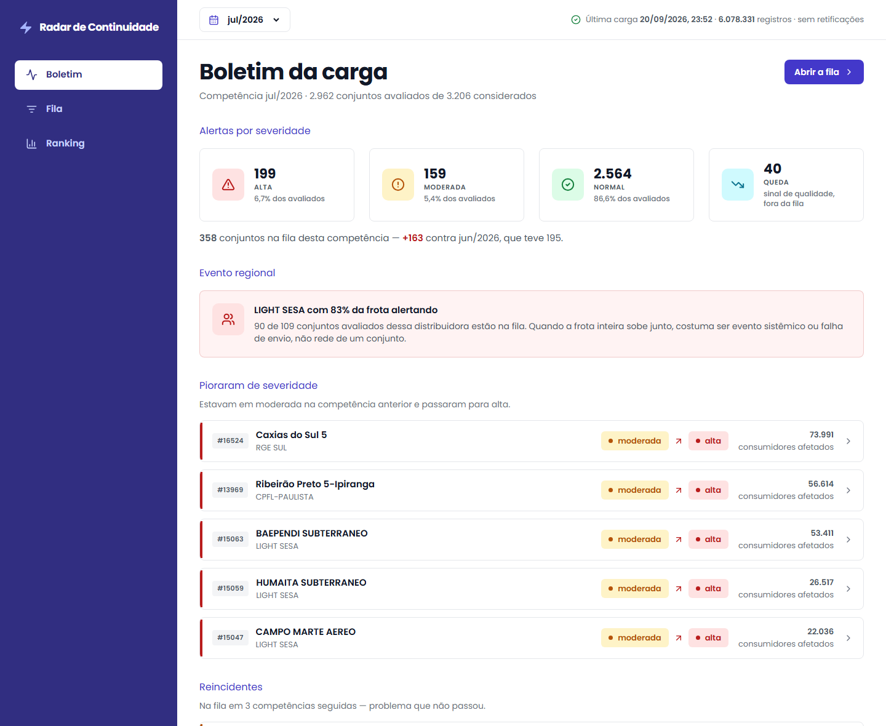

# Radar de Continuidade

Vigilância de conjuntos elétricos a partir dos dados públicos de interrupções
de energia da ANEEL.

A cada nova publicação da base, o sistema identifica quais conjuntos elétricos
fugiram do próprio comportamento histórico e os apresenta como uma **fila de
investigação**, ordenada por quantos consumidores foram afetados.



---

## Sumário

- [O problema](#o-problema)
- [A solução](#a-solução)
- [Como rodar do zero](#como-rodar-do-zero)
- [Como usar](#como-usar)
- [Arquitetura](#arquitetura)
- [Modelo de dados](#modelo-de-dados)
- [Decisões de projeto](#decisões-de-projeto)
- [Limitações conhecidas](#limitações-conhecidas)
- [Próximos passos](#próximos-passos)
- [Stack](#stack)

---

## O problema

A ANEEL publica mensalmente todas as interrupções ocorridas nas redes de
distribuição de energia do país. São arquivos anuais com cerca de **9 milhões
de registros cada** — e que são republicados por inteiro a cada mês, porque as
distribuidoras enviam correções sobre meses já publicados.

Quem precisa acompanhar a qualidade do fornecimento — um analista de operação
ou de área regulatória — enfrenta três obstáculos:

**O volume torna a análise manual inviável.** Nenhuma planilha abre 9 milhões
de linhas, e a cada mês chega um arquivo novo.

**Os números brutos enganam.** Uma distribuidora grande sempre terá mais
interrupções que uma pequena. Sem normalizar pelo número de consumidores
atendidos, qualquer ranking só mede tamanho.

**O que importa é a mudança, não o estado.** Saber que um conjunto teve 200
interrupções não diz nada. Saber que ele costuma ter 40 e teve 200 neste mês
diz tudo.

O resultado prático é que a base existe, é pública, e quase ninguém consegue
usá-la para a pergunta que interessa: **onde a qualidade piorou e o que merece
investigação agora?**

---

## A solução

O sistema responde a essa pergunta em quatro passos:

1. **Ingere** a base da ANEEL, tratando as duas estruturas diferentes em que
   ela é publicada e corrigindo registros retificados sem duplicar nada.
2. **Calcula indicadores normalizados** por consumidor, no nível do conjunto
   elétrico — que é o nível em que a própria ANEEL apura continuidade.
3. **Compara cada conjunto com o próprio histórico**, corrigindo a
   sazonalidade, e classifica quem está fora do padrão.
4. **Apresenta uma fila de investigação** ordenada por impacto: quantos
   consumidores foram atingidos.

O fluxo do usuário é: abre o boletim da carga mais recente → vê o que mudou →
entra na fila de investigação → abre o conjunto suspeito → decide se
investiga.

### Recorte

- **Período:** 2024 a 2026 (~25 milhões de registros)
- **Grão de análise:** conjunto elétrico
- **Eixo temporal:** competência (o mês a que o dado se refere)

---

## Como rodar do zero

### Pré-requisitos

- Docker e Docker Compose
- Python 3.13 (testado nessa versão; deve funcionar em 3.11+, não verificado)
- **Cerca de 11 GB livres em disco**

O espaço se divide assim: o banco fica em **9,4 GB** — quase tudo é a tabela de
fatos com 25 milhões de linhas —, os arquivos Parquet dos três anos somam
698 MB e as imagens Docker outros ~700 MB.

> Se você só quer inspecionar o pipeline sem gastar disco, o passo 5 tem um
> modo `--dry-run` que roda a transformação inteira e imprime os contadores
> **sem gravar nada no banco**. Nesse caso bastam os arquivos Parquet.

### 1. Clonar e configurar

```bash
git clone https://github.com/miguelfelipe09/radar-continuidade.git
cd radar-continuidade
cp .env.example .env
```

### 2. Subir banco e API

```bash
docker compose up -d --build
```

| Serviço | Endereço |
|---|---|
| Interface web | `localhost:4173` |
| API | `localhost:3001` (documentação em `/docs`) |
| PostgreSQL | `localhost:5434` |

O schema é criado aqui mesmo: o serviço `migrate` espera o banco ficar
pronto, aplica as migrations pendentes e encerra — a API só sobe depois que
ele termina com sucesso. Não há passo manual nem dependência de bash no host.
Subir de novo não refaz nada; o log dele apenas informa que não há pendências
(`docker compose logs migrate`).

> Os serviços respondem já neste passo, mas só com dados depois da carga do
> passo 5 — até lá o banco está vazio.

### 3. Preparar o ambiente Python

Os comandos chamam o Python do ambiente virtual pelo caminho, sem ativá-lo —
no Windows, o `activate` pode ser bloqueado pela política de execução de
scripts do PowerShell.

Windows (PowerShell):

```powershell
python -m venv .venv
.venv\Scripts\python.exe -m pip install -r requirements.txt
```

Linux/macOS:

```bash
python3 -m venv .venv
.venv/bin/python -m pip install -r requirements.txt
```

Daqui em diante os comandos aparecem na forma do Windows; no Linux/macOS,
troque `.venv\Scripts\python.exe` por `.venv/bin/python`.

### 4. Baixar os dados da ANEEL

```powershell
.venv\Scripts\python.exe -m etl download --ano 2024
.venv\Scripts\python.exe -m etl download --ano 2025
.venv\Scripts\python.exe -m etl download --ano 2026
```

Cerca de 700 MB no total. O comando consulta o catálogo da ANEEL para
descobrir a URL atual de cada arquivo — não usa link fixo, porque a ANEEL
republica os arquivos mensalmente.

> **Se o download falhar:** o portal da ANEEL fica inacessível em algumas redes
> (confirmado em rede doméstica no Brasil, onde o DNS resolve mas a conexão não
> completa). Nesse caso, baixe os arquivos manualmente em
> [dadosabertos.aneel.gov.br](https://dadosabertos.aneel.gov.br/dataset/interrupcoes-de-energia-eletrica-nas-redes-de-distribuicao)
> e coloque em `data/` com o nome `interrupcoes-energia-eletrica-AAAA.parquet`.

### 5. Carregar

**Conferir sem carregar** — roda a transformação e imprime os contadores de
cada regra de tratamento, sem tocar no banco. É a forma mais rápida de
verificar que os números batem com o
[`ACHADOS.md`](exploracao/ACHADOS.md):

```powershell
.venv\Scripts\python.exe -m etl ingest --ano 2026 --dry-run
```

**Carga completa (~33 minutos)** — os três anos. É a única que mostra o
sistema funcionando:

```powershell
.venv\Scripts\python.exe -m etl ingest --ano 2024 --ano 2025 --ano 2026
```

A agregação e a detecção rodam automaticamente ao fim de cada ingestão. A
detecção cobre **todas as competências do arquivo que já têm 12 meses de
histórico** — não só a última —, então o boletim e a fila funcionam no
primeiro acesso para cada mês. O primeiro ano do recorte (2024) serve só de
histórico e não é detectado: sem 12 meses anteriores, nenhum conjunto teria
baseline.

> O tempo é real, medido na máquina de desenvolvimento a partir de um banco
> vazio: 2024 em 647s, 2025 em 754s (com as 12 detecções mensais) e 2026 em
> 576s (com 7), 1.978s no total. Não é travamento — o pipeline processa 25
> milhões de registros.

**Validação da instalação (~10 minutos)** — carregar só 2026 confirma que o
pipeline roda de ponta a ponta:

```powershell
.venv\Scripts\python.exe -m etl ingest --ano 2026
```

> ⚠️ **Isto não é um atalho para ver o produto.** A detecção exige 12
> competências de histórico, e 2026 sozinho oferece no máximo 6. Com só esse
> ano carregado, **nenhuma competência é detectada**: a ingestão avisa
> "nenhuma competência com 12 meses de histórico" e a interface mostra que
> ainda não há competência detectada. Serve para conferir que o ETL funciona,
> não para avaliar o sistema.

### 6. Conferir

Abra **http://localhost:4173** — o boletim da competência mais recente deve
carregar com dados.

Pela linha de comando:

```bash
curl http://localhost:3001/health
curl http://localhost:3001/api/v1/boletim
```

No Windows PowerShell 5.1, `curl` é um apelido do `Invoke-WebRequest`; use
`curl.exe` para chamar o curl de verdade.

A documentação da API, com o botão "Try it out" em cada rota, fica em
**http://localhost:3001/docs**.

### Demonstração da carga incremental

Este é o ponto central do pipeline: a ANEEL **substitui** o arquivo do ano a
cada publicação, e as distribuidoras retificam registros de meses anteriores.
Reprocessar o mesmo arquivo não pode duplicar nada; reprocessar uma versão
atualizada precisa corrigir o que mudou e dizer quantos mudaram.

Demonstrar isso tem um obstáculo prático: como a ANEEL substitui o arquivo,
**não existe forma de baixar a versão do mês passado**. O projeto contorna
isso com um utilitário que adultera linhas já carregadas, deixando-as como se
fossem a versão anterior do dado — o arquivo real então as corrige.

```powershell
# 1. primeira carga, como se estivéssemos em maio
.venv\Scripts\python.exe -m etl ingest --ano 2026 --ate-competencia 2026-05

# 2. simula a versão anterior: adultera 1.000 linhas de março
#    (roda o psql do serviço migrate, que já enxerga a pasta db/)
docker compose run --rm --entrypoint psql migrate -f /db/simular-retificacao.sql

# 3. segunda carga, com o arquivo completo
.venv\Scripts\python.exe -m etl ingest --ano 2026
```

A terceira etapa insere as competências novas **e** corrige exatamente as
linhas adulteradas:

```
inseridas:    1.433.781   competências 06 e 07, que o corte deixou de fora
atualizadas:      1.000   as linhas que a simulação havia alterado
inalteradas:  4.621.953   o resto do arquivo, reconhecido como já carregado
```

O `db/simular-retificacao.sql` é determinístico — sempre as mesmas 1.000
linhas —, então o número esperado não depende de sorte. Ele não faz parte do
pipeline: existe só para tornar a demonstração reproduzível.

---

## Como usar

Quatro telas, cada uma respondendo a uma pergunta. O caminho natural é de cima
para baixo.

**Boletim da carga** — *o que mudou desde a competência anterior?* Abre com os
alertas por severidade e a variação contra o mês anterior, e destaca o que a
fila sozinha não mostra: conjuntos que **pioraram de severidade** e
**reincidentes**, na fila há três competências seguidas. Traz também as
distribuidoras que pararam de enviar dados e, quando existe, o evento regional
da competência.

**Fila de investigação** — *onde olhar agora?* Tabela ordenada por consumidores
afetados, com filtros de severidade e distribuidora. Quando uma distribuidora
inteira alerta junto, os conjuntos dela viram um bloco único com a conta à
vista, em vez de dezenas de linhas soltas. Conjuntos que sumiram da base ficam
numa seção própria, separados por motivo — falta de dado não é ausência de
problema.

**Detalhe do conjunto** — *o desvio é real?* Série histórica com a faixa normal
do conjunto desenhada por baixo, a comparação com o mesmo mês dos anos
anteriores, as causas em texto bruto e os alimentadores da competência. A faixa
acompanha a sazonalidade: o limite é mais alto nos meses que já são piores.

**Piores distribuidoras** — *quem está pior, e piorou?* Ranking pelo indicador
normalizado, com a variação contra o mesmo mês do ano anterior. A posição 1 é a
pior. Quando a frota da distribuidora mudou entre os dois anos, a comparação
avisa quanto dela cobre.

---

## Arquitetura

```
ANEEL (Parquet)
      │
      ▼
   ETL  ──  Python + DuckDB
      │     dois adaptadores → modelo canônico → upsert idempotente
      ▼
PostgreSQL  ──  fatos + agregação + anomalias + histórico de execuções
      │
      ▼
   API  ──  Node + TypeScript + Express, SQL puro, camadas separadas
      │
      ▼
   Web  ──  React + Vite + TypeScript + Tailwind
```

### ETL

Lê os arquivos Parquet direto com DuckDB, sem carregar tudo em memória. A
transformação acontece em SQL; a carga no Postgres é feita em massa via `COPY`
para uma tabela de staging, e daí um `INSERT ... ON CONFLICT` move para a
tabela final. Nunca há inserção linha a linha.

Comandos disponíveis:

```powershell
.venv\Scripts\python.exe -m etl download   --ano AAAA
.venv\Scripts\python.exe -m etl ingest     --ano AAAA [--ate-competencia AAAA-MM] [--dry-run]
.venv\Scripts\python.exe -m etl aggregate
.venv\Scripts\python.exe -m etl detect     [--competencia AAAA-MM]
```

### Banco

PostgreSQL com schema versionado em migrations SQL numeradas, aplicadas por um
script `sh` simples (`db/migrate.sh`) que roda no serviço `migrate` do
compose, com o `psql` da própria imagem do Postgres. Sem ferramenta de
migration e sem bash no host — é uma dependência a menos para instalar e
explicar, e funciona igual no Windows.

### API

Express com `pg` e SQL puro, sem ORM. Consultas analíticas com agregação e
funções de janela ficam ilegíveis em ORM, e o ganho de abstração não compensa.

Organizada em camadas:

```
api/src/
  routes/        define rotas e vincula ao controller
  controllers/   valida entrada, monta resposta HTTP
  services/      regra de negócio, não conhece Express nem SQL
  repositories/  SQL puro, não conhece HTTP
  models/        tipos das entidades e das respostas
  middlewares/   tratamento de erro, validação, log
  docs/          especificação OpenAPI
```

**Rotas** (documentadas em `/docs`):

| Rota | O que faz |
|---|---|
| `GET /api/v1/competencias` | competências com detecção, para o seletor |
| `GET /api/v1/boletim` | o que mudou desde a carga anterior |
| `GET /api/v1/ranking` | distribuidoras com pior continuidade |
| `GET /api/v1/fila` | conjuntos que merecem investigação |
| `GET /api/v1/conjuntos/:id` | histórico e detalhe de um conjunto |

**CORS.** A API responde a chamadas de navegador apenas das origens listadas em
`CORS_ORIGINS`, separadas por vírgula. O padrão é
`http://localhost:5173,http://localhost:4173`, que cobre o Vite em
desenvolvimento e em preview. Origem fora da lista recebe a resposta sem o
cabeçalho `Access-Control-Allow-Origin`, e o navegador a bloqueia.

**Desempenho medido** (pior de 5 chamadas, cache quente):

```
/boletim                                    74 ms
/ranking?limite=20                          67 ms
/fila?agrupar=distribuidora&tamanho=200     57 ms
/fila?situacao=ausente&tamanho=200          31 ms
/conjuntos/16900                            45 ms
```

A primeira chamada depois de subir o container chega a ~230 ms, por cache frio
do Postgres; da segunda em diante ficam os números acima.

Apenas a rota de detalhe toca a tabela de 25 milhões de fatos, sempre filtrada
por conjunto e competência. As demais leem tabelas de agregação com 95 mil
linhas.

---

## Modelo de dados

| Tabela | Grão | Conteúdo |
|---|---|---|
| `interrupcoes` | uma interrupção | tabela de fatos, ~25M linhas |
| `conjunto_competencia` | conjunto × mês | agregação e indicadores, ~95k linhas |
| `anomalias` | conjunto × mês × execução | resultado da detecção, versionado |
| `conjuntos` | conjunto elétrico | 3.262 registros |
| `conjunto_consumidores_ativos` | conjunto × mês | denominador dos indicadores |
| `conjunto_reconfiguracoes` | conjunto × competência | redesenhos de conjunto |
| `distributors` | distribuidora | 52 registros |
| `municipalities` | município | 5.528 registros |
| `indice_sazonal` | mês × competência × execução | índice sazonal usado em cada avaliação |
| `pipeline_runs` | execução | histórico e contadores de cada carga |

A tabela de fatos **não tem chaves estrangeiras**. Com 25 milhões de linhas
entrando por `COPY`, a verificação linha a linha custaria caro; a integridade
fica a cargo do ETL. As tabelas de dimensão, pequenas, mantêm as suas.

---

## Decisões de projeto

Esta seção resume as decisões e o raciocínio. Os números que embasam cada uma
estão em **[`exploracao/ACHADOS.md`](exploracao/ACHADOS.md)**, junto das
consultas que os produziram.

### A base mudou de estrutura no meio da série

O achado que mais moldou o projeto: os arquivos de 2017 a 2025 têm 18 colunas;
o de 2026 tem 26. **Apenas 6 colunas são comuns às duas versões.** Não foi um
ajuste — foi uma reformulação.

O layout novo trouxe código de município, motivo de expurgo e uma taxonomia de
causa em quatro níveis. O antigo tem a história; o novo recebe as atualizações.

Por isso o ETL tem **dois adaptadores** que convergem para um modelo canônico
único. Sem isso, seria preciso escolher entre ter história e continuar
funcionando.

### Conjunto elétrico, e não alimentador

A primeira ideia era analisar no nível do alimentador, mais granular. A
medição mostrou que não dá:

- apenas **53%** dos códigos de alimentador sobrevivem à mudança de estrutura,
  contra **97%** dos códigos de conjunto;
- e, sobretudo, **o denominador só existe no nível do conjunto** — a contagem
  de consumidores ativos é do conjunto, não do alimentador. Sem ela não há
  indicador normalizado, e sem indicador normalizado a fila não tem como
  priorizar.

O conjunto elétrico é também o nível em que a ANEEL apura os indicadores
oficiais de continuidade.

### Indicadores normalizados por consumidor

Contagem bruta de interrupções sempre elege as maiores distribuidoras. O
sistema calcula dois indicadores no espírito do DEC e do FEC:

```
DEC aproximado = Σ(consumidores afetados × duração em horas) ÷ consumidores ativos
FEC aproximado = Σ(consumidores afetados) ÷ consumidores ativos
```

> **São aproximações, não os valores oficiais da ANEEL.** A apuração oficial
> segue metodologia própria de expurgo e cálculo. Os valores aqui são
> reconstruídos a partir dos dados brutos, e todo campo leva o sufixo `_aprox`
> para deixar isso explícito.

A ordem de grandeza confere: a mediana dá cerca de 12 horas por consumidor por
ano, compatível com as médias do setor no Brasil.

### O pipeline é idempotente, mas o problema real é a retificação

A ANEEL republica o arquivo anual inteiro a cada mês, e as distribuidoras
corrigem registros de meses anteriores. Então processar o mesmo arquivo duas
vezes não pode duplicar nada — mas processar uma versão **atualizada** precisa
corrigir o que mudou.

A solução é upsert por chave natural, com regras diferentes para cada estrutura
de arquivo. No layout novo, a chave fecha após deduplicar 1.298 registros
enviados em duplicidade por três distribuidoras. No antigo, nenhuma combinação
de colunas é única — 3% das ocorrências se desdobram em várias linhas —, o que
exigiu uma coluna de sequência gerada de forma determinística.

### Detecção de anomalias: mediana e IQR, não média e desvio

Média e desvio padrão são destruídos pelo próprio valor extremo que se quer
detectar. O sistema usa mediana e intervalo interquartil (IQR), com o critério
de Tukey.

A comparação é contra o **histórico do próprio conjunto**, corrigido por um
índice sazonal. A sazonalidade é forte e está medida: o indicador mediano vai
de 1,64 em janeiro a 0,73 em julho. Comparar um mês contra o anterior acusaria
a estação do ano, não a rede.

Duas escolhas que exigiram medição:

**Por que índice sazonal e não comparar contra o mesmo mês dos anos
anteriores.** Com três anos de dados, o mesmo mês oferece apenas 1,9 ponto de
comparação em média. Incluir os meses vizinhos sobe para 5,7 — mas o viés
sazonal dessa janela depende do mês avaliado: para julho é inofensivo, para
março e janeiro não. O índice sazonal permite usar toda a história do conjunto,
chegando a **28,6 pontos** de baseline.

**O índice é calculado apenas com competências anteriores à avaliada.** Se
incluísse a competência em análise, um evento de escala nacional inflaria o
índice justamente do mês que deveria ser detectado.

A fila é ordenada por **consumidores afetados**, não pelo tamanho do desvio
estatístico. Um conjunto de 200 consumidores com desvio enorme importa menos
que um de 80 mil com desvio moderado.

### Ausência de dado é informação

Um conjunto que some da base não é um conjunto sem problemas. O sistema
distingue três situações:

| Situação | O que significa |
|---|---|
| `distribuidora_ausente` | a distribuidora inteira parou de enviar |
| `conjunto_encerrado` | o código foi aposentado (ausente há 3+ meses) |
| `conjunto_isolado` | faltou neste mês, provavelmente sem interrupções |

Isso surgiu de um caso concreto: a CPFL-Piratininga enviava 45 conjuntos por
mês até março de 2026 e depois sumiu. Sem esse tratamento, os 45 simplesmente
não apareceriam — e o analista teria uma falsa sensação de cobertura.

### Evento regional versus problema de rede

Em julho de 2026, a LIGHT teve 90 dos seus 109 conjuntos alertando. Antes de
aceitar isso como resultado válido, foi feita uma verificação: as duas
distribuidoras do Rio de Janeiro subiram juntas naquele mês, enquanto uma
distribuidora paulista usada como controle ficou estável. O evento é real.

Mas 90 conjuntos da mesma distribuidora ocupam um quarto da fila. Por isso cada
conjunto carrega a **saturação da frota** — o percentual dos conjuntos avaliados
daquela distribuidora que alertaram. Todo mês tem alguma distribuidora entre
14% e 33%; julho teve 83%. A interface usa esse número para agrupar, sem alterar
a detecção.

### Decisões do front

**Roteador próprio, não React Router.** São quatro telas e um drill-down;
trinta linhas de roteamento por hash entregam URL compartilhável e botão
voltar funcionando, sem mais uma dependência para instalar e versionar.

**CORS escrito à mão.** Vinte linhas no lugar do pacote `cors`, pelo mesmo
motivo. As origens permitidas vêm de variável de ambiente.

**Tipos copiados da API, com checagem automática.** O front espelha
`api/src/models/index.ts` em vez de importar por caminho relativo, porque a
imagem Docker do web não enxerga a pasta da API. Para o espelho não divergir em
silêncio, `npm run checar-tipos` compara os dois byte a byte e falha se
diferirem.

**O seletor de competência vem da API.** A lista não é fixa no front: só
entra o que tem detecção gravada. Uma lista fixa oferecia meses que numa
instalação limpa não existiam — escolhê-los dava erro.

**O índice sazonal é gravado pela detecção, não recalculado no gráfico.** O
baseline vive na escala dessazonalizada, e a série do detalhe mostra DEC bruto:
desenhar o limite exige converter mês a mês. Recalcular o índice na API criaria
duas implementações da mesma regra, livres para divergir — foi o que aconteceu
uma vez com a regra de evento regional, que ficou partida entre API e front.

---

## Limitações conhecidas

**Os indicadores são aproximações.** Não são os valores oficiais de DEC e FEC
apurados pela ANEEL, que seguem metodologia própria.

**A base não cobre todas as distribuidoras do país.** São 52 agentes;
permissionárias e cooperativas menores não aparecem.

**Município só existe a partir de 2026.** O layout antigo não tem código IBGE.
E, mesmo em 2026, 1,6% dos registros vêm com código inválido — todos de uma
única distribuidora, a CELG, concentrados em dois meses.

**A causa da interrupção não é normalizada.** O layout antigo tem 705 formas
diferentes de escrever a mesma hierarquia de causa (variação de separador,
acento e caixa). O texto bruto é armazenado; a normalização completa exigiria
mapeamento manual de vocabulário.

**Conjuntos novos não são avaliados.** É preciso pelo menos 12 meses de
histórico para haver baseline. Em julho de 2026, 112 de 3.206 conjuntos
considerados ficaram de fora por isso — é melhor não avaliar do que avaliar
mal.

**Seis distribuidoras renumeraram a frota entre 2025 e 2026.** Para elas, a
comparação com o ano anterior usa apenas os conjuntos presentes nos dois
períodos, e a sobreposição é informada na resposta. Quando não há nenhum
conjunto em comum, a variação não é calculada.

---

## Próximos passos

Melhorias avaliadas e conscientemente adiadas:

- **Competência na URL.** Hoje ela é estado da aplicação, não endereço: não dá
  para mandar a alguém o link de uma competência específica, nem abrir o
  navegador direto nela. É a próxima melhoria da interface.

- **Normalizar a taxonomia de causa** do layout antigo. Uma padronização
  simples reduz de 705 para 286 valores distintos; chegar aos ~34 do layout
  novo exige mapeamento manual.
- **Detecção em escala logarítmica.** Estatisticamente mais correta para uma
  grandeza com piso em zero, foi simulada: reclassificaria os alertas de forma
  significativa. Não foi adotada por exigir revalidação completa da fila.
- **Suporte a versões anteriores do layout** (2017 a 2023). O ETL já tem a
  estrutura de adaptadores; faltaria apenas mapear o período.
- **Duração mediana contra o histórico do conjunto.** Hoje a fila distingue
  alerta espalhado de alerta apoiado em poucos registros (o sinal de
  concentração), mas não distingue **muitos eventos curtos** de **poucos
  eventos longos** — que são problemas operacionais diferentes: o primeiro
  sugere rede instável com religamento rápido, o segundo sugere dificuldade de
  restabelecimento. Comparar a duração mediana do mês com a do próprio
  histórico separaria os dois casos.
- **Alertas por e-mail ou webhook** quando uma nova carga detecta anomalias.

---

## Stack

| Camada | Tecnologias |
|---|---|
| Ingestão e transformação | Python, DuckDB |
| Banco de dados | PostgreSQL 16 |
| API | Node.js, TypeScript, Express, `pg` |
| Documentação | OpenAPI 3 + Swagger UI |
| Interface | React, TypeScript, Vite, Tailwind, Recharts |
| Infraestrutura | Docker Compose, nginx (serve o build do front) |

---

## Estrutura do repositório

```
radar-continuidade/
├── data/                  arquivos Parquet da ANEEL (não versionado)
├── db/
│   ├── migrations/        schema versionado em SQL
│   ├── migrate.sh         aplicador de migrations
│   └── simular-retificacao.sql   utilitário de demonstração
├── etl/                   pipeline de dados em Python
├── exploracao/            consultas de exploração e ACHADOS.md
├── api/                   API em Node/TypeScript
├── docs/                  imagens do README
├── web/                   interface em React
└── docker-compose.yml
```

---

## Fonte dos dados

[Interrupções de Energia Elétrica nas Redes de Distribuição](https://dadosabertos.aneel.gov.br/dataset/interrupcoes-de-energia-eletrica-nas-redes-de-distribuicao)
— Portal de Dados Abertos da ANEEL. Atualização mensal.

---

## Sobre o desenvolvimento

Este projeto foi desenvolvido com assistência de IA (Claude), usada para exploração dos dados, escrita de código e revisão. As propostas de modelagem e os limiares estatísticos foram discutidos com a IA; a escolha final e a exigência de medição antes de adotar cada regra foram minhas. Cada número citado aqui e no ACHADOS.md veio de uma consulta que rodou sobre a base real.
